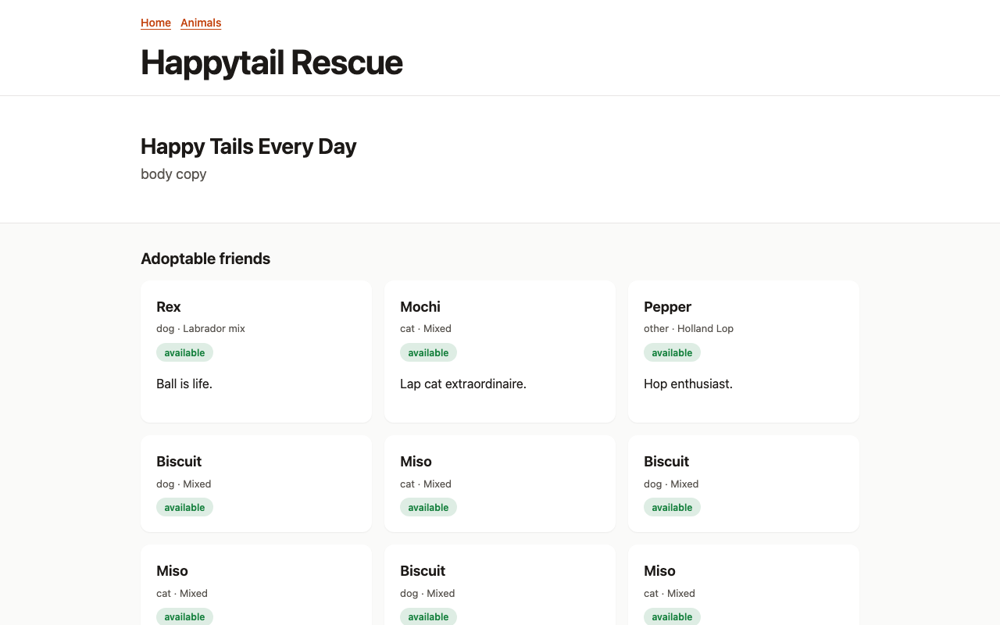

# Deployment Guide

How to run Kithlink, from a laptop to a single VPS to (later) managed cloud.
For the deep reference — full env matrix, Caddy TLS config, backup cron — see
[Self-hosting Kithlink](../self-hosting.md); this page links rather than
repeats it.

Contents:

- [Deployment options](#deployment-options)
- [Production self-host walkthrough](#production-self-host-walkthrough)
- [Upgrades](#upgrades)
- [Backups](#backups)
- [Monitoring](#monitoring)

## Deployment options

| | Local compose dev | Single-VPS self-host | Managed cloud (later) |
| --- | --- | --- | --- |
| Audience | Contributors trying the stack | Shelters/hosts running it themselves | Larger deployments |
| Requirements | Node 20.11+, pnpm 10, Docker | 1 VM (≈1–2 vCPU, 2 GB+), Docker, a domain + DNS | Managed Postgres/Redis/S3 |
| Data stores | Compose: postgres:16, redis:7, MinIO, Mailpit | Same images on the host, or managed equivalents | Cloud services |
| TLS | None needed (HTTP localhost) | Required — reverse proxy, e.g. Caddy ([snippet](../self-hosting.md#3-tls-via-caddy)) | Platform load balancer |
| Secrets | `deploy/compose/.env.example` DEV-ONLY values are fine | **Must change** — see below | Secret manager |
| Guide | [README quickstart](../../README.md) | Below | Not yet documented |

## Production self-host walkthrough

### 1. Provision a host

Any Linux box with Docker support; open inbound 80/443. Keep Postgres, Redis,
and MinIO bound to localhost/private networks only.

### 2. Install Docker

Install Docker Engine + compose plugin from
<https://docs.docker.com/engine/install/> and add your deploy user to the
`docker` group.

### 3. Clone the repo

```bash
git clone https://github.com/krishnacore/kithlink && cd kithlink
pnpm install
```

### 4. Configure `.env`

```bash
cp deploy/compose/.env.example .env   # then EDIT every dev credential
```

Secrets you **must** change before first migrate:

| Variable | Why |
| --- | --- |
| `DATABASE_URL` / `DATABASE_OWNER_URL` | Dev passwords (`kithlink_app_dev`, `kithlink_dev`) are public. Generate: `openssl rand -hex 16`. The owner URL is for migrations only — never give it to the API process. |
| `KITHLINK_MASTER_KEY` | Encrypts addresses and artifact files. Generate: `openssl rand -base64 32`. Never reuse across environments; rotating crypto-shreds old data. |
| `S3_ACCESS_KEY_ID` / `S3_SECRET_ACCESS_KEY` | Dev MinIO values are public — rotate. |

The complete variable matrix lives in
[Self-hosting §2 Environment matrix](../self-hosting.md#2-environment-matrix).

### 5. Start the stack

```bash
docker compose -f deploy/compose/docker-compose.yml up -d   # postgres/redis/minio/mailpit
set -a; source .env; set +a
```

### 6. Run migrations

```bash
pnpm db:migrate     # drizzle migrations + idempotent RLS policies
pnpm turbo build
```

Run migrations with the **owner** URL; the API process itself uses only the
app role so row-level security always applies.

### 7. Create your first shelter + owner

Either seed demo data (**dev only** — creates `happytail` /
`dev@kithlink.dev` / `DevOnly123!x`):

```bash
pnpm --filter @kithlink/server seed
```

…or create them manually with SQL following this pattern:

```sql
insert into shelters (slug, name) values ('mys shelter-slug', 'My Shelter')
  on conflict (slug) do update set name = excluded.name returning id;
-- create user via POST /app/v1/auth/register (or insert users with an argon2 hash),
-- then attach as owner:
insert into staff_members (shelter_id, user_id, role)
values (<shelter-uuid>, <user-uuid>, 'owner');
```

Then sign in at the admin app and add staff per the
[Shelter Admin Guide](../guide/shelter-admin.md#staff-roles).

### 8. TLS via reverse proxy

Serve everything over HTTPS — production session cookies use the `__Host-`
prefix and require it. Use the ready-made Caddyfile:
[Self-hosting §3 TLS via Caddy](../self-hosting.md#3-tls-via-caddy).

### 9. Verify health

```bash
curl localhost:4000/healthz          # {"ok":true}      liveness
curl localhost:4000/readyz           # {"ok":true}      checks DB connectivity
curl localhost:4000/public/v1/version                # {"name":"kithlink","version":"…"}
curl "localhost:4000/public/v1/shelters"             # public registry responds
```

## Upgrades

Migrations-first, forward-only (expand → migrate → contract):

```bash
git fetch --tags && git checkout vX.Y.Z
pnpm install
DATABASE_OWNER_URL=... pnpm db:migrate    # 1. schema moves first
pnpm turbo build                          # 2. then new code
# restart API + workers
```

Rollback = redeploy the previous tag; never edit applied migrations. Check the
changelog before skipping minor versions.

## Backups

Postgres dumps plus object-storage replication; a working cron script and a
quarterly restore drill are in
[Self-hosting §4 Backups](../self-hosting.md#4-backups) and
[docs/runbooks/restore-drill.md](../runbooks/restore-drill.md).

## Monitoring

- Liveness: `GET /healthz`; readiness (DB): `GET /readyz`
- Deployed version: `GET /public/v1/version`
- Logs are structured JSON — ship stdout to your log aggregator
- Alert on `readyz` failures and rising 5xx rates; rate limits are documented
  in [docs/design/03-api.md §5](../design/03-api.md)

Related: [Troubleshooting](../guide/troubleshooting.md).

## Verified install

The end-to-end suite that exercises this stack runs in CI on every push:
build → lint → unit/integration tests against Postgres/MinIO → Playwright journeys.
A green run is the deployment readiness signal.


