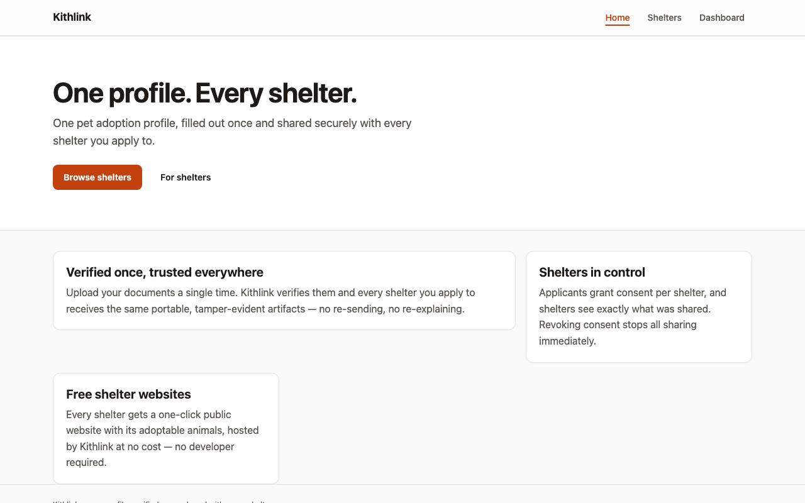
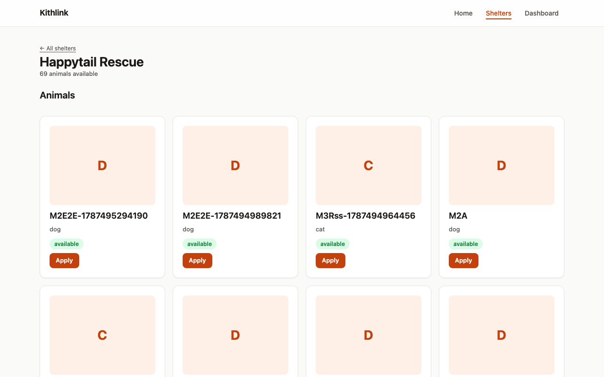
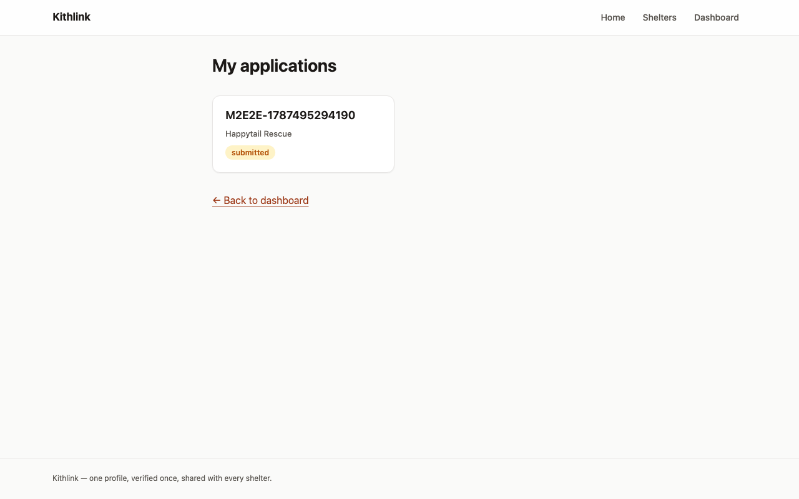
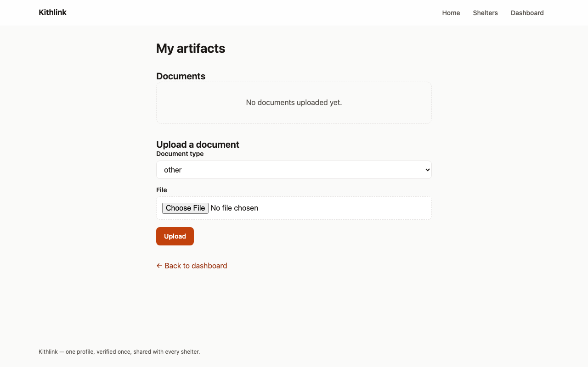
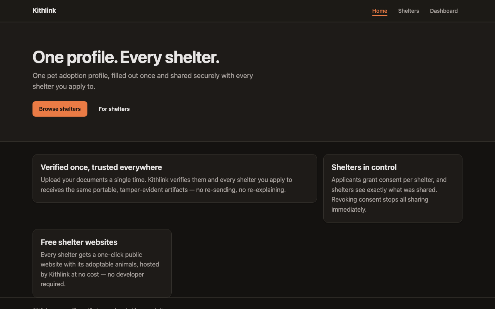
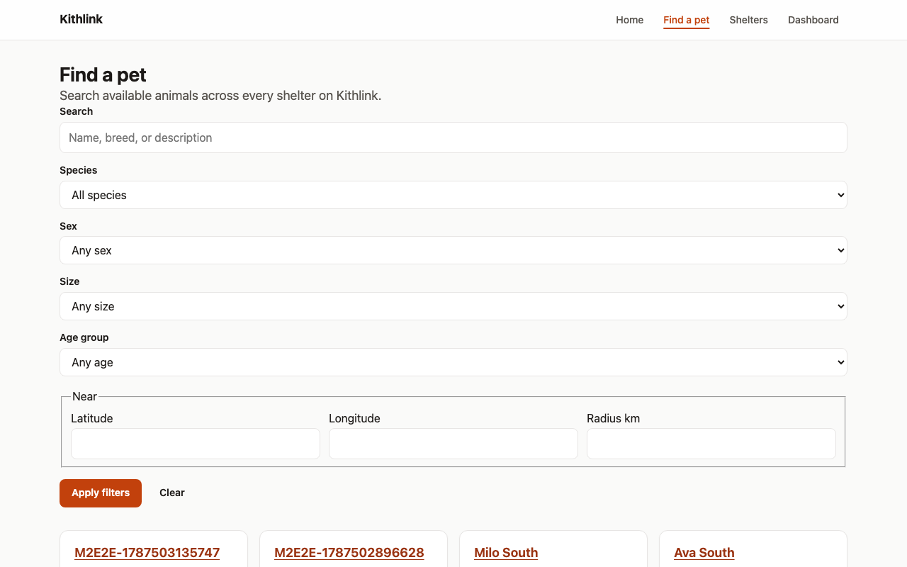

# Applicant Guide

For adopters and pet seekers using the Kithlink web app (in local dev:
`http://localhost:3000`).

Contents:

- [Create an account](#create-an-account)
- [Complete your profile](#complete-your-profile)
- [Upload verification documents](#upload-verification-documents)
- [Apply to an animal](#apply-to-an-animal)
- [Manage consents (who can see what)](#manage-consents)
- [Track your applications](#track-your-applications)
- [FAQ](#faq)

## Create an account

1. Open the home page `/` and click **Browse shelters**, or go straight to
   `/register`.
2. Enter an **Email** and **Password** and click **Create account**.
   Passwords must be at least 10 characters with upper case, lower case, and a
   digit.
3. You are signed in and land on `/dashboard`.

Email verification / magic-link sign-in is **not yet available** — accounts are
created directly with email + password.

## Complete your profile

Your profile is reusable: fill it once and every application attaches it
automatically.

1. From `/dashboard`, open **Profile** (`/profile`).
2. Fill in **Legal name** (required), plus optional **Display name**,
   **Phone** (E.164 format, e.g. `+15551230000`), and **Address**.
3. Click **Save profile**. You will see "Profile saved".

What is stored how:

| Field | Storage |
| --- | --- |
| Legal name, display name | Plain text in the database |
| Phone | Plain text (validated E.164) |
| Address | **Encrypted** at rest (envelope encryption) |

You cannot submit an application until your profile exists — the API rejects
applies with "Complete your applicant profile before applying".

## Upload verification documents

Open **My artifacts** from the dashboard, or go to `/artifacts`.

Accepted files: **PDF, PNG, JPEG, WebP**, up to **25 MB** per file.

Document types (the **Document type** dropdown):

| Type | Typical use |
| --- | --- |
| `lease_addendum` | Signed landlord permission addendum |
| `vet_record` | Vaccination / ownership history |
| `gov_id` | Government-issued ID |
| `utility_bill` | Proof of address |
| `other` | Anything else a shelter requests |

To upload: choose a **Document type**, pick a **File**, click **Upload**
(the button shows "Uploading…" while working).

What happens after upload:

1. The file is encrypted client-side by the API before it lands in object
   storage; only a SHA-256 hash and metadata remain queryable.
2. The artifact is queued for parsing. Its state moves through
   `uploaded → parsing → parsed → pending_review`.
3. Extracted fields appear on the card with a **Confidence %** figure when
   automated extraction ran. You can correct extracted data yourself via the
   manual-extract endpoint (`PATCH /app/v1/me/artifacts/:id/manual-extract`) —
   no LLM extraction runs by default; it is off unless the operator configures
   it, so treat parsed output as a draft you may need to fix.
4. A shelter reviewer then marks it verified or records a discrepancy.

Badges on each document card:

- State badge (`uploaded`, `parsing`, `parsed`, `pending_review`,
  `verified`, `rejected`, `expired`).
- **Network verified** — means at least one *other* shelter has recorded a
  confirmed verification for this document. Other shelters can accept that
  prior confirmation instead of re-doing the check, so you should not need to
  re-verify with every shelter.

## Apply to an animal

1. Browse `/shelters`, open a shelter, and find an animal whose status badge is
   `available`. Click **Apply**.
2. On `/apply/[animalId]` ("Apply for this pet"), answer **Why this pet?** and
   click **Submit application**.
3. You'll see "Application submitted." with a **View my applications** link.

What the shelter receives: your profile (legal/display name, phone), your
questionnaire answers, and visibility into your uploaded artifacts — nothing
else.

What happens to consent: submitting automatically creates a consent grant
(scope `application_review`) for that shelter. While it is active, that
shelter's staff can see your profile and artifacts *for this application*.
When your application reaches a final outcome, the grant's expiry is set to
90 days from that decision, after which access lapses on its own.

## Manage consents

Consents record "who can see what". Each grant shows the shelter, scope
(`application_review`), status (`active`/`revoked`), grant time, and expiry.

Revoking a grant takes effect immediately: the shelter loses all access to your
profile and document contents at once (enforced twice — application checks and
database row-level security). The shelter keeps only its own verification
record about your artifact (method, outcome, date) as part of the shared
verification network; it does not retain ongoing access to the documents.

A dedicated consents screen is **not yet available** in the web UI. Until it
ships, manage grants via the API:

- `GET /app/v1/me/consents` — list your grants ("who can see what")
- `DELETE /app/v1/me/consents/:id` — revoke one immediately

You can also revoke verifications tied to a specific artifact with
`POST /app/v1/me/artifacts/:id/revoke-verifications`.

## Track your applications

Open **My applications** (`/applications`). Each row shows the animal, shelter,
and current status:

| Status | Meaning |
| --- | --- |
| `draft` | Created but not submitted (not produced by the current apply flow) |
| `submitted` | Received; awaiting staff triage |
| `in_review` | Staff are actively evaluating |
| `info_requested` | Staff asked you for more information; supply it and they move it back to `in_review` |
| `approved` | Approved to adopt (terminal) |
| `denied` | Not approved (terminal) |
| `withdrawn` | Withdrawn (terminal) |
| `adopted` | Adoption completed (terminal) |
| `expired` | Lapsed without decision (terminal) |

The `info_requested` loop: staff set your application to `info_requested`
(optionally with a note); once they have what they need they return it to
`in_review` and decide from there.

## FAQ

**Is my data safe?** Addresses and uploaded files are encrypted at rest;
access by shelters is gated per-application by consent and enforced again at
the database level (row-level security). Staff actions are audit-logged.

**Who sees my documents?** Only staff at shelters where you have an active
consent (created by applying). Other shelters never see file contents — at most
they see that a document was previously confirmed by another shelter.

**How do I delete my account?** Account self-deletion is not yet available.
Contact the operator of your Kithlink instance; operators can remove users and
revoking consents cuts off shelter access immediately in the meantime.

See also: [Troubleshooting](troubleshooting.md).

## Screenshots

*Home — one profile, every shelter.*

*Shelter page — available animals and apply links.*

*Applications list with live status badges.*

*Upload lease, vet records and ID once — reuse everywhere.*

*Dark mode follows your device preference.*

## Finding pets

Open **Find a pet** (`/animals`) to search every shelter on the network at once.
Filter by species, sex, size, age group (baby/young/adult/senior), free-text
(name/breed/description), or by location: enter a latitude/longitude and radius to
see results within reach — each card shows how far away the animal is. Open any card
for photos, story, traits and the shelter's details, then hit **Apply**.

