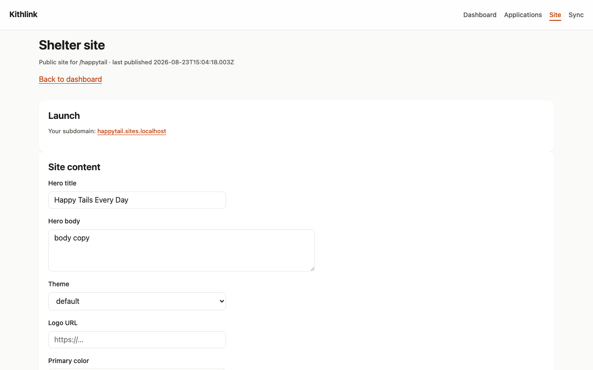
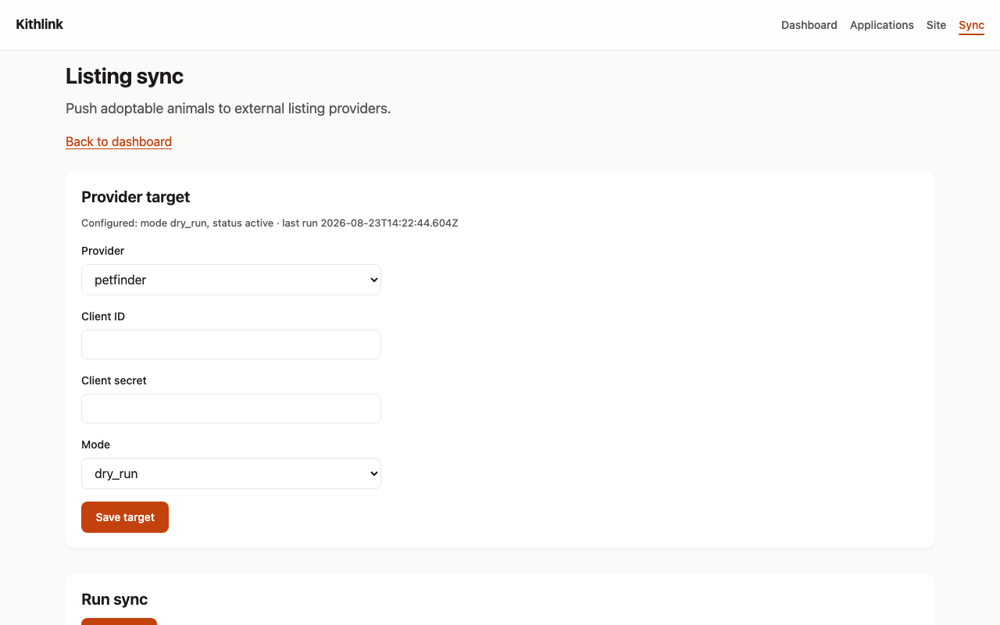

# Shelter Admin Guide

For shelter admins and owners administering the staff app
(`http://localhost:3001` in dev).

Contents:

- [Staff roles](#staff-roles)
- [Building your public website](#building-your-public-website-site)
  - [One-click launch](#one-click-launch)
  - [Custom domains (Beta)](#custom-domains-beta)
- [Syndication](#syndication-sync)
- [RSS feed](#rss-feed)
- [Demo/development credentials (DEV ONLY)](#demo-development-credentials-dev-only)

## Staff roles

Roles are set per shelter. Managing staff is currently done through the admin
API — a dedicated UI page is not yet available:

- `GET /admin/v1/shelters/:shelterId/staff-members` — list (admin/owner)
- `POST /admin/v1/shelters/:shelterId/staff-members` — add by email, default
  role `volunteer`; only an owner can add another owner (admin/owner)
- `PATCH /admin/v1/shelters/:shelterId/staff-members/:userId` — change role;
  only an owner can change an owner (admin/owner)

Capability matrix (from `docs/design/03-api.md` §2.1):

| Capability | viewer | volunteer | coordinator | admin | owner |
| --- | --- | --- | --- | --- | --- |
| View animals/applications | ✓ | ✓ | ✓ | ✓ | ✓ |
| Create/edit animals, photos | | ✓ | ✓ | ✓ | ✓ |
| Move application status (triage) | | | ✓ | ✓ | ✓ |
| Mark artifact verified/rejected | | | ✓ | ✓ | ✓ |
| Edit CMS pages / publish site | | draft only | ✓ | ✓ | ✓ |
| Manage sync targets / API keys | | | | ✓ | ✓ |
| Manage staff & roles | | | | ✓ | ✓ |
| Delete shelter, transfer ownership | | | | | ✓ |

## Building your public website (`/site`)

Open **Site** from `/dashboard`. The page is titled "Shelter site" and shows
your slug and last-published time.

### One-click launch

If the site was never published, a **Launch** card appears at the top of
`/site` with a single **Launch your shelter site** button
(`data-testid="setup-cta"`). It fills in sensible defaults (hero copy, theme,
colors), publishes immediately, and reports your live subdomain —
"Your site is live at `https://<slug>.<SITES_ROOT_DOMAIN>` (N adoptable
animals)" (`data-testid="setup-done"`) — with a **Customize** link down to the
form below. You can always fine-tune everything afterwards and re-publish.

### Site content

| Field | Notes |
| --- | --- |
| **Hero title** | Up to 140 characters |
| **Hero body** | Up to 500 characters |
| **Theme** | `default` or `rescue-min` |
| **Logo URL** | Absolute `https://…` URL (optional) |
| **Primary color** | Hex color picker, e.g. `#2563eb` |

Click **Save** ("Saved." confirms). Saving does not change the public site.

Under **Publish**, click **Publish** to render and go live. Publishing is
atomic: all pages are rendered to object storage and a pointer object
(`sites/<slug>/CURRENT`) is swapped in one step, so visitors never see a half
-updated site. Your site then lives at:

```
<API>/public/v1/sites/<slug>            # index.html
<API>/public/v1/sites/<slug>/animals.html
<API>/public/v1/sites/<slug>/sitemap.txt (and llms.txt)
```

The publish response reports `slug`, `buildId`, `publishedAt`, and the animal
count included.

### Subdomain serving

Besides the API path above, your site is served directly at
`<slug>.<SITES_ROOT_DOMAIN>` (dev default: `happytail.sites.localhost`). The
web app inspects the `Host` header: hosts listed in `APP_PRIMARY_HOSTS` get the
normal app; anything else is looked up as a shelter site and rewritten to its
published pages. Production needs wildcard DNS `*.<SITES_ROOT_DOMAIN>` → your
web host plus a TLS certificate covering that wildcard — see
[Deployment Guide](../deploy/overview.md#shelter-sites-subdomains--custom-domains).

### Custom domains (Beta)

Under **Custom domain** on `/site` you can claim your own hostname
(e.g. `adopt.example.org`):

1. Enter the domain and click **Add domain** — it's stored as `pending` and a
   verification token is shown.
2. Create a DNS TXT record named `_kithlink.<domain>` with value
   `kithlink-verify=<token>`.
3. Click **Verify** once DNS has propagated. Verified domains are listed with
   an `verified` badge; remove them with the delete action.

Until TXT verification passes, the domain stays `pending`. If Verify keeps
failing, see [Troubleshooting](troubleshooting.md#custom-domain-stuck-in-pending).

## Syndication (`/sync`)

Open **Sync** from `/dashboard` to push your `available` animals to external
listing sites.

### Add a Petfinder target

Under **Provider target**: choose **petfinder** as the Provider, enter your
Petfinder **Client ID** and **Client secret**, pick a **Mode**, and click
**Save target**. Credentials are encrypted before storage.
(Adopt-a-Pet exists as an adapter at the API level; only petfinder appears in
the UI dropdown today.)

### Dry-run vs live mode

| Mode | Behavior |
| --- | --- |
| `dry_run` | Computes every push decision locally and records results — **never contacts Petfinder**. Use this first to preview what would be created/updated. |
| `live` | Actually calls the Petfinder API with your credentials. |

Operators can additionally force sandbox behavior instance-wide with the
`PETFINDER_MODE=dry_run` environment variable, regardless of per-target mode,
and enable a nightly automatic run over live targets with `ENABLE_SYNC_CRON=1`.

### Run and read results

Click **Run sync** under **Run sync**. The summary line reads e.g.
"Pushed 3, failed 0, 5 decisions."

- *Pushed* — animals sent to the provider (in live mode) or that would be sent
  (dry-run).
- *Failed* — errors, with reasons recorded per animal.
- *Decisions* — per-animal outcomes (`create`, `update`, `skip`, …) stored on
  the run record.

A dry-run showing decisions but no listing appearing on Petfinder is expected —
see [Troubleshooting](troubleshooting.md).

## RSS feed

Every shelter has an RSS feed with zero configuration:

```
<API>/public/v1/feed/shelters/<slug>/rss.xml
```

It lists currently available animals (name, species, breed, description),
cached for 5 minutes. Point aggregators or partner sites at it if you don't use
syndication yet.

## Demo/development credentials (DEV ONLY)

The seed script creates a demo shelter for local development:

- Shelter: `happytail` (Happytail Rescue)
- Owner login: `dev@kithlink.dev` / `DevOnly123!x`
- Sample animals in mixed statuses (Rex, Mochi, Bruno, Luna, Pepper, Daisy)

Run it with: `pnpm --filter @kithlink/server seed`

These credentials are **for development only** — never seed them into a
production deployment, and always create real staff accounts with strong
passwords there.

See also: [Shelter Staff Guide](shelter-staff.md),
[Self-hosting reference](../self-hosting.md).

## Screenshots


*Site editor — hero, theme and brand tokens, then Publish.*


*Syndication target management with dry-run mode.*


*The published public site, generated from your inventory.*
