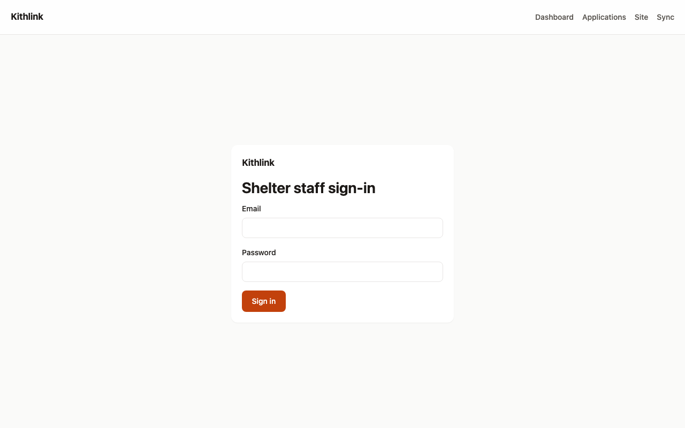
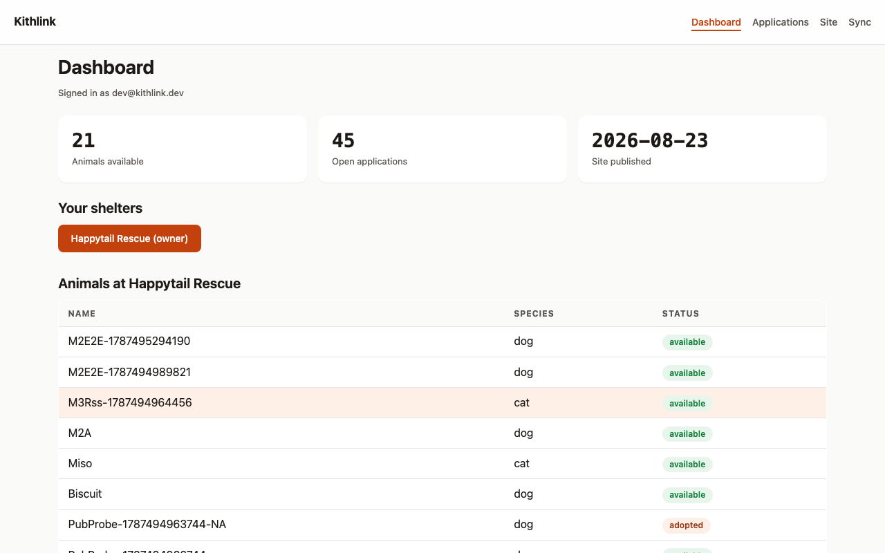
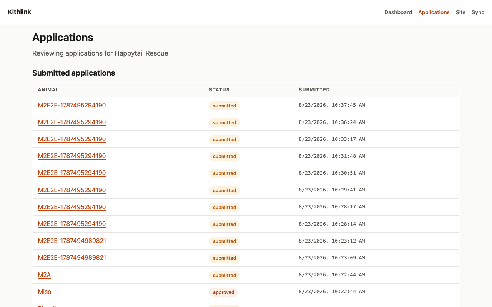

# Shelter Staff Guide

For volunteers and adoption coordinators using the staff app (in local dev:
`http://localhost:3001`).

Contents:

- [Sign in](#sign-in)
- [Dashboard](#dashboard)
- [Animals and their statuses](#animals-and-their-statuses)
- [Reviewing applications](#reviewing-applications)
- [Verifying applicant artifacts](#verifying-applicant-artifacts)
- [Audit trail](#audit-trail)

## Sign in

Open the staff app root `/`. The **Shelter staff sign-in** page takes
**Email** and **Password**; click **Sign in**. Sessions last 30 days.

Demo credentials exist only for development — see
[Shelter Admin Guide](shelter-admin.md#demo-development-credentials-dev-only).

## Dashboard

After sign-in you land on `/dashboard`:

- **Your shelters** — if you belong to several, click a shelter name to select
  it (the selected one is highlighted).
- Links at the top: **Applications**, **Site**, **Sync**.
- **Animals at \<your shelter\>** — a table of Name / Species / Status with a
  status badge per animal.

## Animals and their statuses

The dashboard table is read-only. Creating and editing animals is currently
done through the admin API (a full editor UI is not yet available). All of
these require an active session; create/update require `volunteer` role or
above:

- `GET /admin/v1/shelters/:shelterId/animals` — list
- `POST /admin/v1/shelters/:shelterId/animals` — create
  (`name`, `species` dog/cat/other, `breed`, `birthYear`, `sex`, `size`,
  `description`, `status`)
- `PATCH /admin/v1/shelters/:shelterId/animals/:id` — update
- `POST /admin/v1/shelters/:shelterId/animals/:id/photos` — attach a photo via
  the presigned-upload flow; photo metadata is stored with the animal

Status lifecycle and what it publishes:

| Status | Meaning | Publicly visible? |
| --- | --- | --- |
| `draft` | Profile in progress | No |
| `available` | Accepting applications | Yes — public registry, your website, RSS, syndication |
| `pending` | Application in progress | Not listed as available |
| `adopted` | Homed | Shown as adopted, never as available |

Only `available` animals show an **Apply** button to applicants.

## Reviewing applications

Open **Applications** (`/applications`) from the dashboard. The
"Submitted applications" table lists Animal / Status / Submitted; click an
animal name to open the detail page `/applications/[id]`.

The detail page shows:

- **Applicant** — legal/display name, phone, and the consent line
  (`Consent: application_review (active)` etc.). If consent shows as revoked or
  expired, artifact access is cut off.
- **Questionnaire** — the applicant's answers as JSON.
- **Artifacts** — each document card with its state badge, extracted fields,
  verification timeline, and the verification action buttons described below.

### Setting status

Application status changes are made with
`PATCH /admin/v1/shelters/:shelterId/applications/:id/status`
(body: `status` plus optional `note`, 1–2000 chars) and require `coordinator`
role or above. Valid transitions:

| From | You can move to |
| --- | --- |
| `submitted` | `in_review`, `denied`, `withdrawn` |
| `in_review` | `info_requested`, `approved`, `denied` |
| `info_requested` | `in_review`, `denied`, `withdrawn` |
| `approved` | `adopted` |
| `denied`, `withdrawn`, `adopted`, `expired` | terminal — no further moves |

Notes on the loop: use `info_requested` when you need more from the applicant;
return to `in_review` once answered. When an application reaches any terminal
outcome, its consent grant expiry is fixed at 90 days past the decision, so the
applicant's data access winds down automatically.

## Verifying applicant artifacts

On the application detail page, each artifact card offers up to three actions
(available to `coordinator`/`admin`/`owner`; they call
`POST /admin/v1/shelters/:shelterId/artifacts/:artifactId/verifications`):

| Button | Records | Use when | Effect |
| --- | --- | --- | --- |
| **Confirm landlord call** | method `landlord_call`, outcome `confirmed` | You called the landlord and the pet policy checks out | Artifact state becomes `verified`. Best practice: put the call summary in notes and set a `validUntil` date. |
| **Mark discrepancy** | method `landlord_call`, outcome `discrepancy` | The document contradicts what the landlord said, or details don't match | A discrepancy record is kept; state is unchanged. Note exactly what mismatched. |
| **Accept prior verification** | method `prior_verification`, outcome `confirmed` | The card shows the network-verified badge and your shelter has no prior confirmation of its own | Honors another shelter's confirmation instead of re-calling; does not itself flip network status. |

What the applicant sees: artifact state changes (e.g. `verified`), the
**network verified** badge once any *other* shelter has confirmed, and the
verification timeline entries (shelter name, method, outcome, date).

## Audit trail

Every consequential action — logins, submissions, status changes,
verifications, staff role changes, site publishes — is appended to an
append-only audit log. Entries are tamper-evident by design and are not
readable or editable through staff accounts.

Practical implications for your daily work:

- You don't need to keep parallel records of status decisions or verification
  calls beyond the `note` fields — those are captured with actor and timestamp.
- If a decision is ever questioned, the timeline (who changed what, when) can
  be reconstructed from the audit log by an admin/operator.
- Verification notes you write should describe facts observed (what the
  landlord said, what mismatched), not opinions — they persist alongside the
  verification record.

See also: [Applicant Guide](applicants.md) for the adopter-side view,
[Shelter Admin Guide](shelter-admin.md) for roles and publishing.

## Screenshots

*Staff sign-in.*

*Dashboard — inventory, open applications, site status at a glance.*

*Review queue.*

## Applicant history & verification provenance

Every application review screen has a **History** card: all past applications this
person made to *your* shelter (any status), plus — for artifacts they consented to
share — the full verification provenance: which shelter verified it, when, by what
method, and until when it counts. Your own records stay visible even after a consent
expires; other shelters' data only appears while an active grant exists.

## Notes

Leave internal **Notes** on any application (they are audited and never shown to
applicants).
